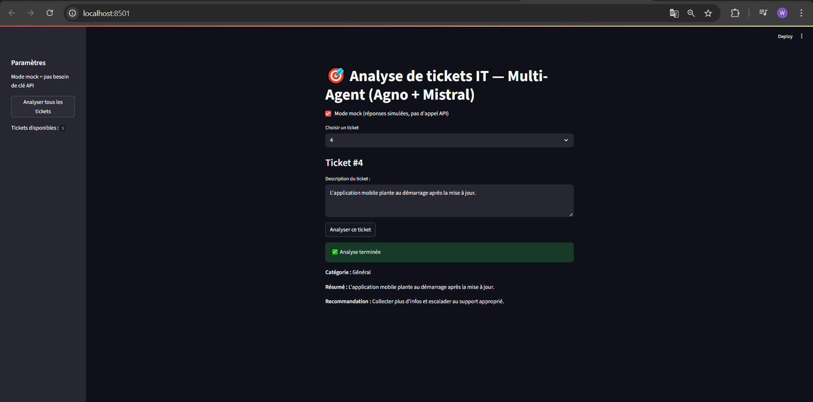

# 🎯 IT Support Analyzer — Multi-Agent (Agno + Mistral + Streamlit)

## 📌 Description

Ce projet est une **application web** développée avec **Streamlit**, intégrant un système **multi-agent** utilisant **Agno** et **Mistral** pour analyser des tickets de support IT.

💡 **Objectif :**  
Automatiser l'analyse de tickets IT en trois étapes :
1. **Catégorisation** du ticket (réseau, application, matériel, accès, général).
2. **Résumé** concis de la demande.
3. **Recommandation** de solution adaptée.

⚠️ **Note importante :**  
Les tickets utilisés dans ce projet sont **mockés** (fictifs) afin de simuler des cas réels, car aucune donnée réelle n'était disponible.

---

## 🛠 Fonctionnalités

- Mode **mock** (pas besoin de clé API).
- Mode **API réelle** avec **Mistral** (via Agno) pour une analyse en langage naturel.
- Interface web interactive avec **Streamlit**.
- Analyse **d'un ticket** ou **de tous les tickets** en un clic.
- Affichage des résultats :
  - Catégorie
  - Résumé
  - Recommandation

---

### Image 1 : System

---

